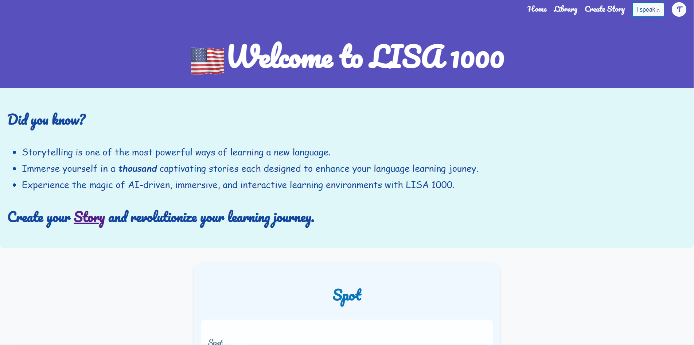

Lisa 1000 - Reinventing Language Learning

LISA 1000 is an AI-aided language learning tool that uses storytelling to help users learn English. This project includes a web interface where users can read, listen, and narrate stories.

## Table of Contents

- [Features](#features)
- [Installation](#installation)
- [Usage](#usage)
- [Technologies](#technologies)
- [Course Project Reflection](#course-project-reflection)
- [Contributing](#contributing)
- [License](#license)
- [Demo](#demo)

## Features

- **Text to Speech**: Via OpenAI's TTS API + Choice of voice.
- **Speech to Text Synthesis**: Webkit speech recognition to capture user narration.
- **ChatCompletion**: Implemented with different roles for a richer interaction.
- **DALL-E Image Generation**: Generate images to accompany your stories.
- **Interactive User Interface**: Visually appealing and highly interactive UI.
- **Visually Appealing User Interface**: Enhanced design for better user experience.
- **Unrestricted Functionality**: No limitations on creativity and usage.

## Installation

To get started with Lisa 1000, follow these steps:

1. **Clone the repository**:
    ```bash
    git clone https://github.com/bern1ard0/lisa-1000.git
    ```

2. **Navigate to the project directory**:
    ```bash
    cd lisa-1000/myproject
    ```

3. **Install the dependencies**:
    ```bash
    npm install
    ```

4. **Set up the OpenAI API key**:
    - Create a `.env` file in the `myproject` directory.
    - Add your OpenAI API key to the `.env` file:
      ```plaintext
      OPENAI_API_KEY=your_openai_api_key
      ```

5. **Start the server**:
    ```bash
    npm start
    ```

6. **Open your browser and navigate to**:
    ```url
    http://localhost:3000
    ```

## Usage

### Create a Story

1. Navigate to the "Create Story" tab.
2. Choose between "Lisa's Story" and "My Story".
3. For "Lisa's Story", you can generate random stories or fine-tune options such as genre, length, and emotion.
4. For "My Story", fill in the form with your story details and generate your personalized story.

### Translate a Story

1. Select your native language from the dropdown menu.
2. Click the "Translate" button to translate the displayed story into the selected language.

### Narrate a Story

1. Click the "Narrate" button to start the speech recognition.
2. Speak into your microphone, and the recognized text will be displayed.
3. Use the "Play" button to hear the text read aloud or your recorded narration.

### Additional Features

- **Speech-to-Text Synthesis**: Convert spoken words into text using speech recognition.
- **Word Definitions**: Double-click on any word to get its definition.
- **Translation Toggle**: Activate translation mode to translate selected text.
## Technologies

- **Frontend**:
  - HTML5
  - CSS3
  - JavaScript

- **Backend**:
  - Node.js
  - Express.js

- **APIs**:
  - Web Speech API for speech recognition and synthesis
  - OpenAI API for text-to-speech and DALL-E image generation
  - Custom translation API endpoint

## Course Project Reflection

### Expansive Design

- **Intuitive Navigation**: Use of icons to make navigation more user-friendly.
- **Global Outreach**: Designed for users from varied backgrounds to experience AI-driven immersive language learning.
- **Immersive Experience**: Incorporates audio-visual elements for enhanced learning and entertainment.

## Contributing

Contributions are welcome! To contribute to Lisa 1000, follow these steps:

1. **Fork the repository**.
2. **Create a new branch**:
    ```bash
    git checkout -b feature-branch
    ```

3. **Make your changes**.
4. **Commit your changes**:
    ```bash
    git commit -m "Add new feature"
    ```

5. **Push to the branch**:
    ```bash
    git push origin feature-branch
    ```

6. **Create a pull request**.

## License

This project is licensed under the MIT License.

## Demo

To see Lisa 1000 in action, check out our demo video:

[](https://www.youtube.com/watch?v=YOUR_VIDEO_ID)

Replace `YOUR_VIDEO_ID` with the actual YouTube video ID of your demo. If the video is hosted on another platform, replace the link accordingly.



